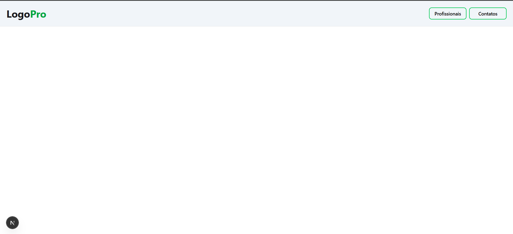
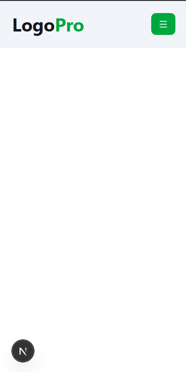
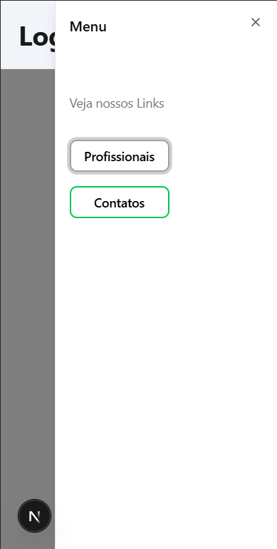

#### Preview Web Home



#### Preview Mobile Home


#### Preview Mobile Menu


#### Inciando Prisma
    ``` 1.
    npm i prisma --save-dev
    ```

    ``` 2.
    npx prisma init
    ```

    ``` 3. prisma client
    npm i @prisma/client
    ```

    ``` 4. src/lib/prisma.ts
    import { PrismaClient } from "@prisma/client";

        let prisma: PrismaClient;

        if (process.env.NODE_ENV === "production") {
            prisma = new PrismaClient();
        } else {
            let globalWithPrisma = global as typeof globalThis & {
                prisma: PrismaClient;
            };

            if (!globalWithPrisma.prisma) {
                globalWithPrisma.prisma = new PrismaClient();
            }

            prisma = globalWithPrisma.prisma;
        }

        export default prisma;
    ```

#### Adpter
npx auth secret
npm install next-auth@beta
npm install @auth/prisma-adapter

#### Fazendo nossa migration
npx prisma migrate dev

#### Toda vez que fazer uma migration
npx prisma generate
npx prisma generate

#### Verificar as tabelas criadas
npx prisma studio

#### Forms para Profil
form validate, zod
npx shadcn@latest add form
npx shadcn@latest add input
npx shadcn@latest add select

#### 33 uma travada erro

* Alterar no profile.tsx
```
// import { Prisma } from "@prisma/client"
import { Prisma } from "@/generated/prisma" // 
```

* alterar no profile/page.tsx
```
import { redirect } from 'next/navigation'
import getSession from '@/lib/getSession'
import { getUserDate } from './_data_access/get-info-user'
import { ProfileContent } from './_components/profile'

export default async function Profile() {
  const session = await getSession()

  if (!session) {
    redirect("/")
  }

  const user = await getUserDate({ userId: session.user?.id })

  if (!user) {
    redirect("/") // ou outra ação
  }

  return <ProfileContent user={user} />
}
```

#### Messagens
npm install sonner

#### Date Picker
npm install react-datepicker --save
lembrar de importar
import "react-datepicker/dist/react-datepicker.css"
``` criando
"use client"

import { useState} from "react"
import { ptBR } from "date-fns/locale/pt-BR"
import "react-datepicker/dist/react-datepicker.css"
import DatePicker, { registerLocale } from "react-datepicker"

registerLocale("pt-BR", ptBR)

interface DateTimePickerProps{
    minDate?: Date;
    className?: string;
    initialDate?: Date;

    onChange: (date: Date) => void;
}

export function DateTimePicker( { initialDate, className, minDate, onChange} : DateTimePickerProps) {
    const [startDate, setStartDate] = useState( initialDate || new Date())

    function handChange(date: Date | null){
        if(date){
            console.log(date);
            setStartDate(date);
            onChange(date)
        }
    }
    return(
        <DatePicker
            className={className}
            selected={startDate}
            locale="pt-BR"
            minDate={minDate ?? new Date()}
            onChange={handChange}
            dateFormat="dd/MM/yyyy"
        />
    )
}
```
``` usando
<FormField
                        control={form.control}
                        name="phone"
                        render={ ({ field }) => (
                            <FormItem className="my-2">
                                <FormLabel className="font-semibold">Telefone:</FormLabel>
                                <FormControl>
                                    <Input 
                                        {...field}
                                        id="phone"
                                        placeholder="Digite seu telefone"
                                        onChange={ (e) => {
                                            const formattedValue = formatPhone(e.target.value)
                                            field.onChange(formattedValue)
                                        }}
                                    />
                                </FormControl>
                            </FormItem>
                        )}
                    />
```
npm install date-fns --save

#### Teste
http://localhost:3000/empresa/cmfsdeqj30000v3103d84wrd1